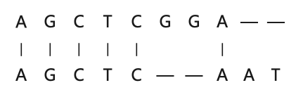
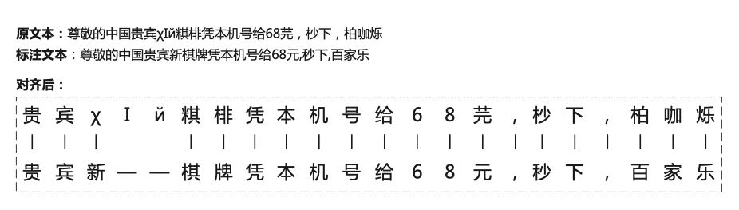
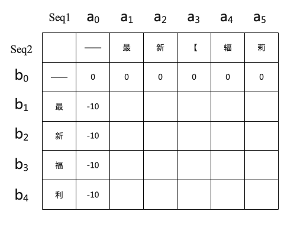
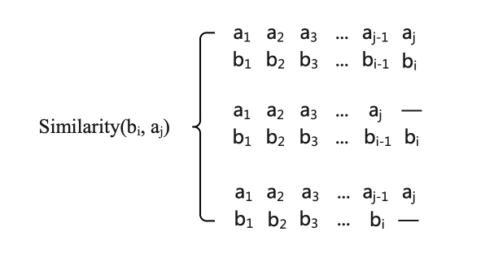
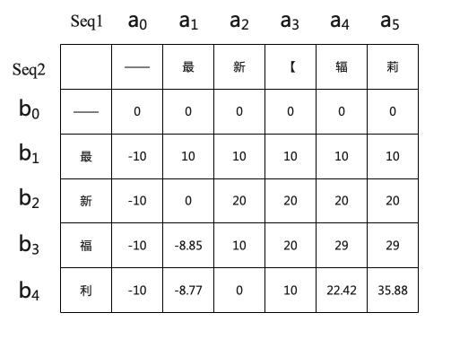
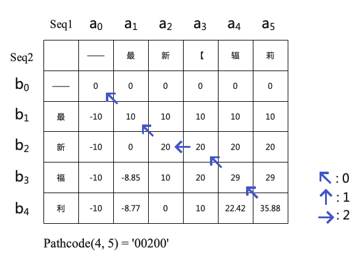
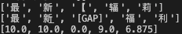

# Variant-Needleman-Wunsch-sequence-alignment-algorithm-based-on-similarity-of-characters
基于相似度的序列对齐算法

### 0 背景引入

序列对齐算法源自于计算生物学，通过最大化局部相似性来对齐DNA序列、蛋白质序列等生物序列。

比如输入两序列`ATCGCGGA`和`AGCTCAAT`:

同样在中文纠错、变体字识别等任务场景中也会出现需要使用序列对齐算法来快速完成序列标注，为接下来的模型训练做好准备工作。

不难发现，对于DNA序列而言，各个位置仅有`AGCT`四种可能值而且可以直接判断是否相同。所以传统的序列对齐算法的评价指标为对齐后两序列的最大公共字串长度最长(可不连续)或者两序列的编辑距离最短。但是由人为精心构造的变体序列是专门为了绕过审查监管的，在极端情况下，甚至该序列中每个字都与标注序列不同但是不影响表意。在这种情况下，传统的序列对齐算法无能为力。

**因此，我在原有算法的基础上，提出了基于字符相似度的序列对齐算法，使得对齐后两序列各位置字符相似度之和最大。**

### 1 字符相似度计算

在序列中，原文本中字符应包括汉字、英文字母、数字、常见中英文标点符号以及unicode中其他非常字符。字符相似度计算函数$simi\_score(i, j)$用来给出两字符的相似度得分, 对于不同类型的字符间相似度计算规则如下：

1. 若两字符均为汉字，则采用基于汉字音形码的相似度计算函数，详见[这个博客](https://blog.csdn.net/chndata/article/details/41114771)。音形码可以表示汉字在读音上和字形上的特征，包括了声母、韵母、音调、汉字结构、四角编码和笔画数。将汉字使用音形码嵌入后通过特定的计算公式计算相似度。
2. 若两字符均为字母或者均为数字，则直接判断两字符是否相等。
3. 若两字符为中英文常见符号，可以通过中英文字符转换(e.g. `:/：, (/（, </《`)后再直接比较。
4. 其他不同种类字符的字符相似度为`0.0`

5. 其他任意字符与`[GAP]`符的相似度均为`0.0`

字符相似度计算的规则是自定义的，目前这种字符相似度计算函数仍需解决的问题是简单忽略了英文字母和汉字读音上的相似性，比如扣和Q、微和V、加和J等。

### 2 基于字符相似度匹配的序列对齐算法

本序列对齐算法以Needleman-Wunsch算法为基础，借鉴其动态规划的思想并引入字符相似度计算函数完成。该算法公式表示如下：

对于两序列$seq1= a_1a_2a_3...a_m$和$seq2=b_1b_2b_3...b_n$，定义序列相似度矩阵$Similarity$，其中$Similarity(i,j)$表示两序列($a_1a_2a_3...a_j$和$b_1b_2b_3...b_i$)对齐后的序列最大相似度。最终根据该矩阵即可获得两序列相似度最大的对齐方式。

#### 2.1 矩阵初始化

首先对该矩阵进行初始化。由于我默认`Seq1`为原序列，`Seq2`为标注序列，`Seq1`的冗余度较高，长度均大于`Seq2`，故使`Seq2`向`Seq1`对齐，即仅在`Seq2`中加入`—`。所以矩阵初始化如下所示。

#### 2.2 矩阵传播

根据动态规划的思想可得该矩阵各个位置的传播公式如下：
$$
similarity(i, j) = 
max \begin{cases}
Similarity(i-1, j-1) + simi_score(i, j)\\
Similarity(i-1, j) + simi_score(i, -)\\
Similarity(i, j-1) + simi_score(-, j)
\end{cases}
$$ { }
该传播计算公式更加直观的理解如下所示，该矩阵坐标为(i, j)的值取决于如下三种方式对齐后两序列相似度的最大值。

根据该传播公式即可得到Similarity矩阵中各个位置的值。示例如下所示。

#### 2.3 回溯

根据定义，我们可以看到矩阵右下角的值为两序列对齐后的最大相似度，即Similarity(4, 5)的值35.88为两序列以某种方式对齐后得到的最大序列相似度。那是那种对齐方式呢？我们需要从35.88这个值是如何得到来寻找答案，也就是对矩阵进行回溯。

同样我们采用动态规划的思想写出回溯公式，如下所示：
$$
pathcode(i, j) = 
\begin{cases}
'\ ' & if\ i=0, j=0 \\
pathcode(0, j-1) + '1' & if\ i=0, j\neq0 \\
pathcode(i-1, 0) + '2' & if\ j=0, i\neq0 \\
\\
pathcode(i-1, j-1) + '0' & if\ Similarity(i-1, j-1) = max \\
pathcode(i, j-1) + '1' & if\ Similarity(i, j-1) = max \\
pathcode(i-1, j) + '2' & if\ Similarity(i-1, j) = max \\
\end{cases}
$$
其中`pathcode(i, j)`表示移动至`Similarity`矩阵`(i, j)`位置处的回溯路径，`0`表示对角线移动、`1`表示横向移动、`2`表示纵向移动。示例回溯后如下图所示。

可以注意到回溯路径通常有多条，即对角线的值、上方、左方的值可能会出现相等的情况，但是我们可以筛选出最符合我们目标的一条路径，即按照对角线、左方、上方的优先级回溯，因为我们不想在序列中插入更多的`—`。（如果想要得到所有的回溯路径，一种方法是通过Similarity矩阵构建一颗三叉树，然后获得所有根节点到叶子结点的路径。）

最后遍历`Pathcode(n, m)`，出现`0`时，两序列均前进一位；出现`1`时，`Seq1`序列添加`—`; 出现`2`时，`Seq2`序列添加`—`。最终即可得到对齐后的两序列。我们可以发现，重新计算对齐后两各个位置的字符相似度并求和其实就是矩阵右下角的值。

